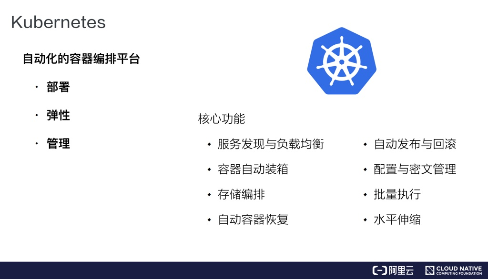
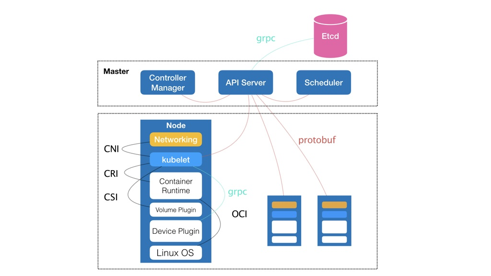
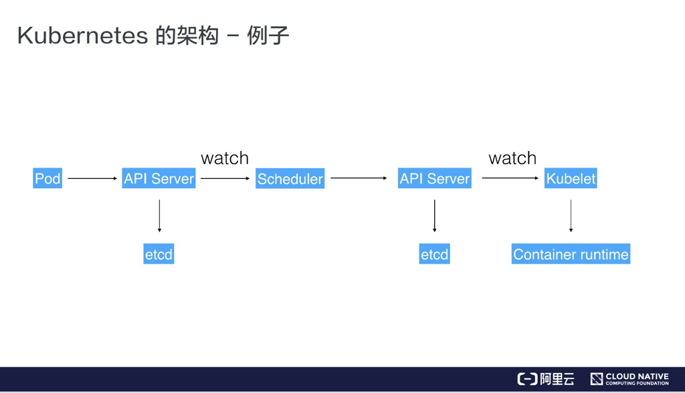
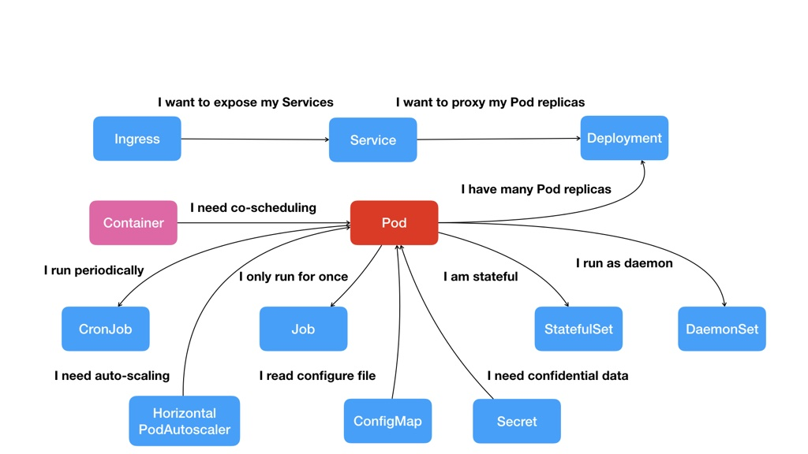

Kubernetes 是一个自动化的容器编排平台，负责容器应用的部署、健康检查、弹性伸缩等管理工作

**Kubernetes 的核心能力**

**Kubernetes 架构**

Kubernetes 架构是一个典型的二层架构（Mater 和 Node）和 CS 架构（client-server）。Master 作为中央的管控节点，会去与 Node 进行一个连接。所有的K8S集群管理操作界面、CLI 这些用户侧的组件，都只会和 Master 进行连接，Master 会将这些命令下发给相应的节点进行执行。

- Master 控制节点包含四个主要的组件：
    - API Server
        - 提供组件通信服务，K8S 中所有的组件都会和 API Server 进行连接，组件与组件之间一般不进行独立的连接，都依赖于 API Server 进行消息的传递
    - Controller Manager
        - 控制器，不断检查各个Pod是否符合声明的状态，如果不一致，就进行相应的新增、删除、替换工作
    - Scheduler
        - 调度器，根据每个Pod对CPU，Memory的要求，负责把它放到合适的Node上
    - Etcd
        - 高可用的分布式存储系统，负责整个集群状态信息的存储

- Node 工作节点包含五个主要组件：
    - Kubelet
        - 真正去运行Pod的组件，与 API Server 进行通信，获取到所需要运行的Pod的状态，通过CRI(Container Runtime Interface) 远程调用接口，向 Container Runtime 发起创建容器请求
    - Container Runtime
        - 容器运行时组件（比如Docker），通过 OCI（容器运行时规范）同底层的Linux操作系统进行交互，把 CRI 请求翻译成对 Linux 操作系统的调用（也就是操作Linux系统的 namespace, cgroups, chroot），完成容器的创建
    - Kube-Proxy
        - 负责对 Kubernetes 集群自己的服务发现网络 Service Network 的管理，它利用了 iptable 来实现
    - Storage Plugin
        - 负责对容器存储的管理
    - Network Plugin
        - 负责对容器网络的管理

下面我们来看一下在K8S集群上创建Pod的例子

- 用户通过操作界面或者CLI提交了一个 Pod 给 K8S 进行部署，这个 Pod 请求被提交给了 API Server
- API Server 会把这个信息写入到存储系统 Etcd 中，然后通过 watch 机制 Scheduler 直到了有一个 Pod 需要被调度
- Scheduler 根据目前集群的资源状态进行了一次调度决策，然后汇报给 API Server 此次调度信息（这个 Pod 需要被调度到哪个节点上）
- API Server 接收到调度信息后，将其写入 Etcd，然后通知相关 Node节点的 kubelet 去执行
- Kubelet 得到通知，调用 Container Runtime 进行容器的创建和运行，调用 Storage Plugin 去配置存储，调用 Network Plugin 去配置网络
- 创建 Pod 任务完成

**Kuberrnetes 中的核心概念及API**

- Pod
    - 从Container这个最基础的概念出发，首先遇到了容器间紧密协作关系的问题，于是就扩展到了Pod
- Deployment
    - 有了Pod之后，我们希望能一次启动多个应用的实例，于是用Deployment来管理Pod副本集
- Service
    - 有了一组Pod后，我们又需要通过一个固定的IP地址和端口以负载均衡的方式访问它，于是就有了Service(一个Pod只是一个运行服务的实例，随时可能在一个节点上停止，在另一个节点以一个新的IP启动一个新的Pod，因此不能以确定的IP和端口号提供服务)
- Secret
    - 如果两个不同Pod之间，需要互相访问，并且还要提供授权信息（典型例子就是Web应用对数据库访问时需要Credential信息），于是Kubernetes提供了Secret对象（本质是保存在Etcd里的键值对数据），你把Credential信息以Secret的方式存在Etcd中，在需要使用的Pod中声明，那么在Pod启动时，Kubernetes就会自动把Secret里的数据以Volume的形式挂载到容器里
- Job、DeamonSet、CronJob
    - 根据应用运行形态的不同，Kubernetes定义了基于Pod改进后的对象，比如Job，用来描述一次性运行的Pod；比如DaemonSet，用来描述每个宿主机上必须且只能运行一个副本的守护进程服务；比如Cronjob，用来描述定时任务。