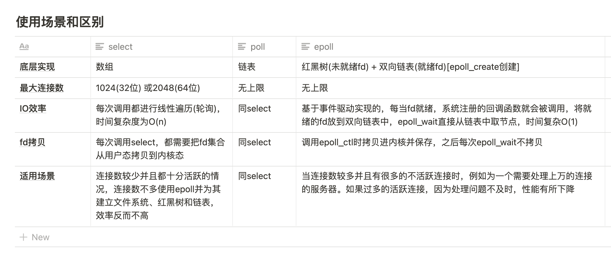

# 从阻塞 I/O 到 I/O 多路复用

阻塞 I/O，是指进程发起调用后，会被挂起（阻塞），直到收到数据再返回。如果调用一直不返回，进程就会一直被挂起。因此，当使用阻塞 I/O 时，需要使用**多线程**来处理多个文件描述符。

多线程切换有一定的开销，因此引入非阻塞 I/O。非阻塞 I/O 不会将进程挂起，调用时会立即返回成功或错误，因此可以在**一个线程**里*轮询*多个文件描述符是否就绪。

但是非阻塞 I/O 的缺点是：每次发起系统调用，只能检查**一个**文件描述符是否就绪。当文件描述符很多时，系统调用的成本很高。

因此引入了 I/O 多路复用，可以**通过一次系统调用，检查多个文件描述符的状态**。这是 I/O 多路复用的主要优点，相比于非阻塞 I/O，在文件描述符较多的场景下，避免了频繁的用户态和内核态的切换，减少了系统调用的开销。

I/O 多路复用相当于将「遍历所有文件描述符、通过非阻塞 I/O 查看其是否就绪」的过程从用户线程移到了内核中，由内核来负责轮询。

- `select`：调用开销大（需要复制集合）；集合大小有限制；需要遍历整个集合找到就绪的描述符
- `poll`：poll 采用链表的方式存储文件描述符，没有最大存储数量的限制，其他方面和 select 没有区别
- `epoll`：调用开销小（不需要复制）；集合大小无限制；采用回调机制，不需要遍历整个集合

`select`、`poll` 都是在用户态维护文件描述符集合，因此每次需要将完整集合传给内核；`epoll` 由操作系统在内核中维护文件描述符集合，因此只需要在创建的时候传入文件描述符。

此外 select 只支持水平触发，epoll 支持边缘触发。

**epoll 中水平触发以及边缘触发有什么不同**

- 水平触发的主要特点是，如果用户在监听`epoll`事件，当内核有事件的时候，会拷贝给用户态事件，但是如果用户只处理了一次，那么剩下没有处理的会在下一次epoll_wait再次返回该事件。
- 这样如果用户永远不处理这个事件，就导致每次都会有该事件从内核到用户的拷贝，耗费性能，但是水平触发相对安全，最起码事件不会丢掉，除非用户处理完毕。
- 边缘触发，相对跟水平触发相反，当内核有事件到达， 只会通知用户一次，至于用户处理还是不处理，以后将不会再通知。这样减少了拷贝过程，增加了性能，但是相对来说，如果用户马虎忘记处理，将会产生事件丢的情况。

水平触发、边缘触发的名称来源：数字电路当中的电位水平，高低电平切换瞬间的触发动作叫边缘触发，而处于高电平的触发动作叫做水平触发。

为什么边缘触发必须使用非阻塞 I/O？

- 边缘触发模式需要循环读/写一个文件描述符的所有数据。如果使用阻塞 I/O，那么一定会在最后一次调用（没有数据可读/写）时阻塞，导致无法正常结束

refer: [https://imageslr.com/2020/02/27/select-poll-epoll.html](https://imageslr.com/2020/02/27/select-poll-epoll.html)
