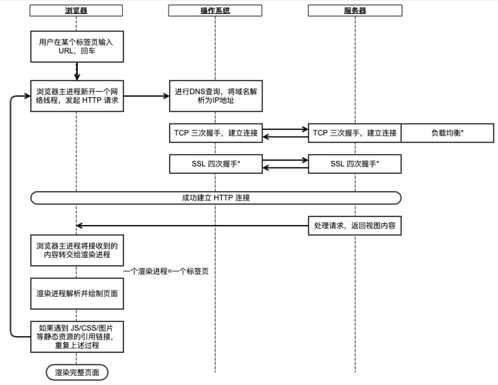

**整体流程**

1. 用户在某个标签页输入 URL 并回车后，浏览器主进程会新开一个网络线程，发起 HTTP 请求
    - 浏览器检查自带的“预加载 HSTS（HTTP严格传输安全）”列表，这个列表里包含了那些请求浏览器只使用HTTPS进行连接的网站
    - 如果网站在这个列表里，浏览器会使用 HTTPS 而不是 HTTP 协议，否则，最初的请求会使用HTTP协议发送
    - 注意，一个网站哪怕不在 HSTS 列表里，也可以要求浏览器对自己使用 HSTS 政策进行访问。浏览器向网站发出第一个 HTTP 请求之后，网站会返回浏览器一个响应，请求浏览器只使用 HTTPS 发送请求。然而，就是这第一个 HTTP 请求，却可能会使用户受到 downgrade attack 的威胁，这也是为什么现代浏览器都预置了 HSTS 列表。
2. 浏览器会进行 DNS 查询，通过DNS查询将域名解析为 IP 地址
    - 检查域名是否在缓存当中
    - DNS缓存: 浏览器缓存——>hosts文件——>路由器缓存——>网络服务商缓存——>根域名服务器缓存
3. 浏览器获得 IP 地址后，向服务器请求建立 TCP 连接
    - TCP三次握手
        - 客户端选择一个初始序列号(ISN)，将设置了 SYN 位的封包发送给服务器端，表明自己要建立连接并设置了初始序列号
        - ***服务器端接收到 SYN 包，如果它可以建立连接：***服务器端选择它自己的初始序列号服务器端设置 SYN 位，表明自己选择了一个初始序列号服务器端把 (客户端ISN + 1) 复制到 ACK 域，并且设置 ACK 位，表明自己接收到了客户端的第一个封包
        - ***客户端通过发送下面一个封包来确认这次连接：***自己的序列号+1接收端 ACK+1设置 ACK 位
        - ***数据通过下面的方式传输：***当一方发送了N个 Bytes 的数据之后，将自己的 SEQ 序列号也增加N另一方确认接收到这个数据包（或者一系列数据包）之后，它发送一个 ACK 包，ACK 的值设置为接收到的数据包的最后一个序列号
        - ***关闭连接时：***要关闭连接的一方发送一个 FIN 包另一方确认这个 FIN 包，并且发送自己的 FIN 包要关闭的一方使用 ACK 包来确认接收到了 FIN
    - TLS握手
        - 客户端发送一个 `ClientHello` 消息到服务器端，消息中同时包含了它的 Transport Layer Security (TLS) 版本，可用的加密算法和压缩算法。
        - 服务器端向客户端返回一个 `ServerHello` 消息，消息中包含了服务器端的TLS版本，服务器所选择的加密和压缩算法，以及数字证书认证机构（Certificate Authority，缩写 CA）签发的服务器公开证书，证书中包含了公钥。客户端会使用这个公钥加密接下来的握手过程，直到协商生成一个新的对称密钥
        - 客户端根据自己的信任CA列表，验证服务器端的证书是否可信。如果认为可信，客户端会生成一串伪随机数，使用服务器的公钥加密它。这串随机数会被用于生成新的对称密钥
        - 服务器端使用自己的私钥解密上面提到的随机数，然后使用这串随机数生成自己的对称主密钥
        - 客户端发送一个 `Finished` 消息给服务器端，使用对称密钥加密这次通讯的一个散列值
        - 服务器端生成自己的 hash 值，然后解密客户端发送来的信息，检查这两个值是否对应。如果对应，就向客户端发送一个 `Finished` 消息，也使用协商好的对称密钥加密
        - 从现在开始，接下来整个 TLS 会话都使用对称秘钥进行加密，传输应用层（HTTP）内容
    - HTTP 的长连接与短连接与2.0
        - HTTP/1.0 默认使用的是短连接。也就是说，浏览器每请求一个静态资源，就建立一次连接，任务结束就中断连接。
        - HTTP/1.1 默认使用的是长连接。长连接是指在一个网页打开期间，所有网络请求都使用同一条已经建立的连接。当没有数据发送时，双方需要发检测包以维持此连接。长连接不会永久保持连接，而是有一个保持时间。实现长连接要客户端和服务端都支持长连接。
        - 长连接的优点：TCP 三次握手时会有 1.5 RTT 的延迟，以及建立连接后慢启动（slow-start）特性，当请求频繁时，建立和关闭 TCP 连接会浪费时间和带宽，而重用一条已有的连接性能更好。
        - 长连接的缺点：长连接会占用服务器的资源。
        - HTTP 2.0 的三大特性是头部压缩、服务端推送、多路复用。
            - HTTP 1.1 允许通过同一个连接发起多个请求。但是由于 HTTP 1.X 使用文本格式传输数据，服务端必须按照客户端请求到来的顺序，串行返回数据。此外，HTTP 1.1 中浏览器会限制同时发起的最大连接数，超过该数量的连接会被阻塞。
            - HTTP 2 引入了多路复用，允许通过同一个连接发起多个请求，并且可以并行传输数据。HTTP 2 使用二进制数据帧作为传输的最小单位，每个帧标识了自己属于哪个流，每个流对应一个请求。服务端可以并行地传输数据，而接收端可以根据帧中的顺序标识，自行合并数据。
            - 在 HTTP 1.1 中，由于浏览器限制每个域名下最多同时有 6 个请求，其余请求会被阻塞，因此我们通常使用多个域名（比如 CDN）来提高浏览器的下载速度。HTTP 2 就不再需要这样优化了。
            - 同理，在 HTTP 1.1 中，我们会将多个 JS 文件、CSS 文件等打包成一个文件，将多个小图片合并为雪碧图，目的是减少 HTTP 请求数。HTTP 2 也不需要这样优化了。
4. 浏览器向服务器发起 HTTP 请求
5. 服务器处理请求，返回 HTTP 响应
6. 浏览器的渲染进程解析并绘制页面
7. 如果遇到 JS/CSS/图片 等静态资源的引用链接，重复上述过程，向服务器请求这些资源

- TCP四次挥手
    - 流程:
        1. 客户端应用程序发出释放连接的报文段，并停止发送数据，主动关闭 TCP 连接。客户端主机发送释放连接的报文段，报文段中首部 FIN 位置为 1 ，不包含数据，序列号位 seq = u，此时客户端主机进入 FIN-WAIT-1(终止等待 1) 阶段。
        2. 服务器主机接受到客户端发出的报文段后，即发出确认应答报文，确认应答报文中 ACK = 1，生成自己的序号位 seq = v，ack = u + 1，然后服务器主机就进入 CLOSE-WAIT(关闭等待) 状态。
        3. 客户端主机收到服务端主机的确认应答后，即进入 FIN-WAIT-2(终止等待2) 的状态。等待客户端发出连接释放的报文段。
        4. 这时服务端主机会发出断开连接的报文段，报文段中 ACK = 1，序列号 seq = v，ack = u + 1，在发送完断开请求的报文后，服务端主机就进入了 LAST-ACK(最后确认)的阶段。
        5. 客户端收到服务端的断开连接请求后，客户端需要作出响应，客户端发出断开连接的报文段，在报文段中，ACK = 1, 序列号 seq = u + 1，因为客户端从连接开始断开后就没有再发送数据，ack = v + 1，然后进入到 TIME-WAIT(时间等待) 状态，请注意，这个时候 TCP 连接还没有释放。必须经过时间等待的设置，也就是 2MSL 后，客户端才会进入 CLOSED 状态，时间 MSL 叫做最长报文段寿命（Maximum Segment Lifetime）。
        6. 服务端主机收到了客户端的断开连接确认后，就会进入 CLOSED 状态。因为服务端结束 TCP 连接时间要比客户端早，而整个连接断开过程需要发送四个报文段，因此释放连接的过程也被称为四次挥手。
    - 关闭连接的方式通常有两种，分别是 RST 报文关闭和 FIN 报文关闭。
    - 如果进程异常退出了，内核就会发送 RST 报文来关闭，它可以不走四次挥手流程，是一个暴力关闭连接的方式。

    **TIMEWAIT**

    - TIME_WAIT 状态相当于是客户端在关闭前的最后一个状态，它是一种主动关闭的状态；而 LAST_ACK 是服务端在关闭前的最后一个状态，它是一种被动打开的状态。
    - 需要 TIME_WAIT 状态的原因:
        - 防止延迟的数据段被其他使用相同源地址、源端口、目的地址以及目的端口的 TCP 连接收到；
        - 保证 TCP 连接的远程被正确关闭，即等待被动关闭连接的一方收到 `FIN` 对应的 `ACK` 消息；
    - 为什么是 2 MSL 的时长呢？
        - 这其实是相当于至少允许报文丢失一次。比如，若 ACK 在一个 MSL 内丢失，这样被动方重发的 FIN 会在第 2 个 MSL 内到达，TIME_WAIT 状态的连接可以应对。
    - 客户端受端口资源限制：如果客户端 TIME_WAIT 过多，就会导致端口资源被占用，因为端口就65536个，被占满就会导致无法创建新的连接；
    - 服务端受系统资源限制：由于一个四元组表示TCP连接，理论上服务端可以建立很多连接，服务端确实只监听一个端口，但是会把连接扔给处理线程，所以理论上监听的端口可以继续监听。但是线程池处理不了那么多一直不断的连接了。所以当服务端出现大量 TIME_WAIT 时，系统资源被占满时，会导致处理不过来新的连接；
    - Linux 提供了 tcp_max_tw_buckets 参数，当 TIME_WAIT 的连接数量超过该参数时，新关闭的连接就不再经历 TIME_WAIT 而直接关闭：

    **同时关闭**

    - 由于 TCP 是全双工的协议，所以是会出现两方同时关闭连接的现象，也就是同时发送了 FIN 报文。当客户端与服务端同时发起 FIN 报文请求关闭连接时, 都认为自己是主动方，所以都进入了 FIN_WAIT1 状态，FIN 报文的重发次数仍由 tcp_orphan_retries 参数控制。接下来，双方在等待 ACK 报文的过程中，都等来了 FIN 报文。这是一种新情况，所以连接会进入一种叫做 CLOSING 的新状态，它替代了 FIN_WAIT2 状态。接着，双方内核回复 ACK 确认对方发送通道的关闭后，进入 TIME_WAIT 状态，等待 2MSL 的时间后，连接自动关闭。

refer: 

- [https://imageslr.com/2020/02/26/what-happens-when-you-type-in-a-url.html](https://imageslr.com/2020/02/26/what-happens-when-you-type-in-a-url.html)
- [https://github.com/skyline75489/what-happens-when-zh_CN](https://github.com/skyline75489/what-happens-when-zh_CN)